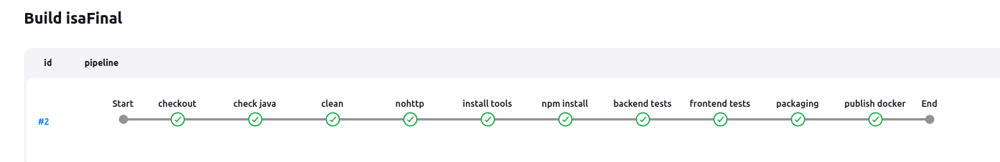

# Final para la materia Ingeniería de Software Aplicada

### Pasos

1. Crear un proyecto con JHipster basado en algun modelo de este [repositorio](https://github.com/jhipster/jdl-samples). En este caso se usará el modelo de la libreria.

```bash
jhipster jdl libreria.jh
# --client-framework vue # para aclarar que framework de front-end se usará
```

2. Correr el proyecto

```bash
./mvnw
```

3. Para probar los tests de unidad ir a la carpeta `src/test/` y correr los tests de unidad.

4. Para probar los tests E2E ir a la carpeta `src/test/javascript` y correr los tests E2E con el siguiente comando. Es necesario tener el proyecto corriendo.

```bash
npm run cypress
```

### Para probar lo de ELK

1. Tener instalado docker y docker-compose

2. Tener descargado este [repositorio](https://github.com/deviantony/docker-elk)

3 Ejectuar el siguiente comando en la carpeta del repositorio descargado

```bash
docker-compose up setup
```

4. Ejectuar el siguiente comando en la carpeta del repositorio descargado

```bash
docker-compose up
```

5. Luego ir a `http://localhost:5601/` con los credeciales `elastic` y `changeme` y crear un indice con el nombre `logstash-*` y seleccionar el campo `@timestamp` como campo de tiempo.

## Para ingresar a Jenkins

```bash
docker container run -d --name jenkins -p 8090:8080 -p 50000:50000 jenkins/jenkins
docker exec -it jenkins bash
cd /var/jenkins_home/secrets/cat initialAdminPassword
```

Ingresar a localhost:8090 y colocar la password. Instalar los plugins sugeridos.

### Link a la imagen de [Docker](https://hub.docker.com/repository/docker/santidotpy/isa-final/general)

> [!NOTE]  
> En mi caso tuve que crear una Access Token en DockerHub para usar como password en Jenkins y asi poder subir la imagen



